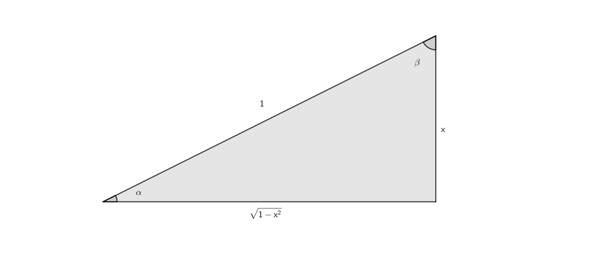

## 0.Start

### 0.1.双曲函数与反三角函数

$$
\alpha =\arcsin {x}=\arccos{\sqrt{1-x^2}}=\arctan{\frac{x}{\sqrt{1-x^2}}}=\text {arccot}{\frac{\sqrt{1-x^2}}{x}}
$$

$$
\beta=\arcsin{\sqrt{1-x^2}}=\arccos{x}=\arctan{\frac{\sqrt{1-x^2}}{x}}=\text {arccot}\frac{x}{\sqrt{1-x^2}}
$$
___

$$
\sec x=\frac{1}{\cos x},\csc x=\frac{1}{\sin x}.
$$

$$
{(\sec x)}^{'}=\tan x\cdot\sec x,{(\csc x)}{'}=-\cot x\cdot\csc x.
$$
___

$$
{(\arcsin x)}'=\frac{1}{\sqrt{1-x^2}},{(\arccos x)}'=-\frac{1}{\sqrt{1-x^2}}.
$$

$$
{(\text{arcsh}\ x)}'=\frac{1}{\sqrt{1+x^2}},{(\text{arcch}\ x)}'=\frac{1}{\sqrt{x^2-1}}.
$$

$$
{(\arctan x)}^{'}=\frac{1}{1+x^2},{(\text {arccot}\ x)}^{'}=-\frac{1}{1+x^2}.
$$

$$
{(\text{arcth}\ x)}'=\frac{1}{1-x^2}
$$

$$
{(\text {arcsec}\ x)}^{'}=\frac{1}{|x|\sqrt{x^2-1}},{(\text {arccsc}\ x)}^{'}=-\frac{1}{|x|\sqrt{x^2-1}}.
$$
___

$$
e^{ix}=\cos x+i\sin x
$$

$$
e^x=\ch x+\sh x
$$

$$
\cos x=\frac{e^{ix}+e^{-ix}}{2},\sin x=\frac{e^{ix}-e^{-ix}}{2i},\tan x=\frac{1}{i}\cdot \frac{e^{ix}-e^{-ix}}{e^{ix}+e^{-ix}}.
$$

$$
\ch x=\frac{e^{x}+e^{-x}}{2},\sh x=\frac{e^{x}-e^{-x}}{2},\th x=\frac{e^{x}-e^{-x}}{e^{x}+e^{-x}}.
$$
___

$$
i\sh x=\sin ix\quad or\quad i\sin x=\sh ix
$$

$$
\ch x=\cos ix\quad or\quad \cos x=\ch ix
$$

$$
i\th x=\tan ix\quad or\quad i\tan x=\th ix
$$
___

$$
\text {arcch}\ x=\left
\{
\begin{aligned}
&\ln (x+\sqrt{x^2-1})\ ,\ \text{arcch}\ x>=0\\
&\ln (x-\sqrt{x^2-1})\ ,\ \text{arcch}\ x<0
\end{aligned}
\right.
$$

$$
\text {arcsh}\ x=\ln (x+\sqrt{x^2+1})
$$

$$
\text {arcth}\ x=\ln\sqrt{\frac{1+x}{1-x}}
$$

$$
\arccos x=\ln (ix+i\sqrt{x^2+1}),\arcsin x=\frac{1}{i}\cdot\ln (ix-i\sqrt{x^2-1}),\arctan x=\frac{1}{i}\cdot \ln\sqrt{\frac{i-x}{i+x}}
$$
___

$$
\text{arcsh}\ x=\arcsin ix\quad or\quad \arcsin x=\text{arcsh}\ ix
$$

$$
i\ \text{arcch}\ x=\arccos ix\quad or\quad i\arccos x=\text{arcch}\ ix
$$

$$
\text{arcth}\ x=\arctan ix\quad or\quad \arctan x=\text{arcth}\ ix
$$